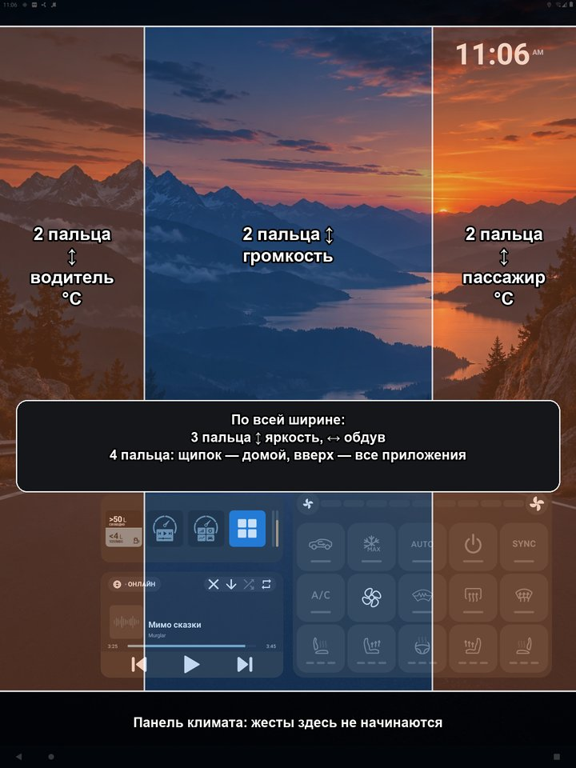
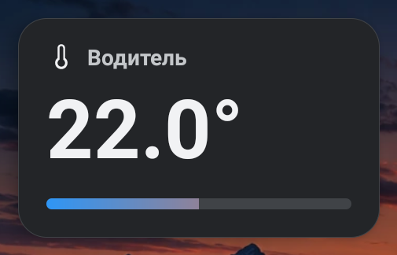
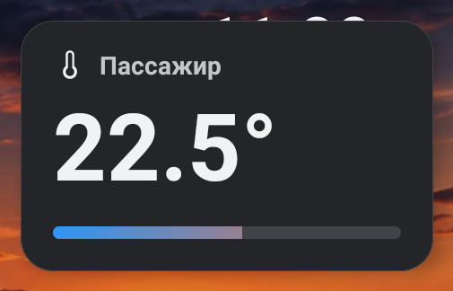
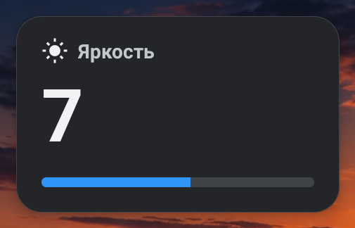
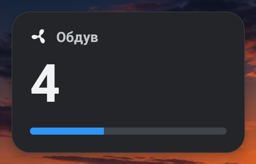
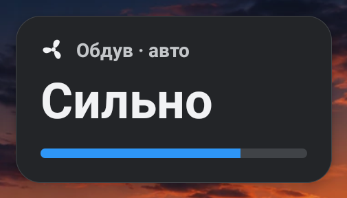
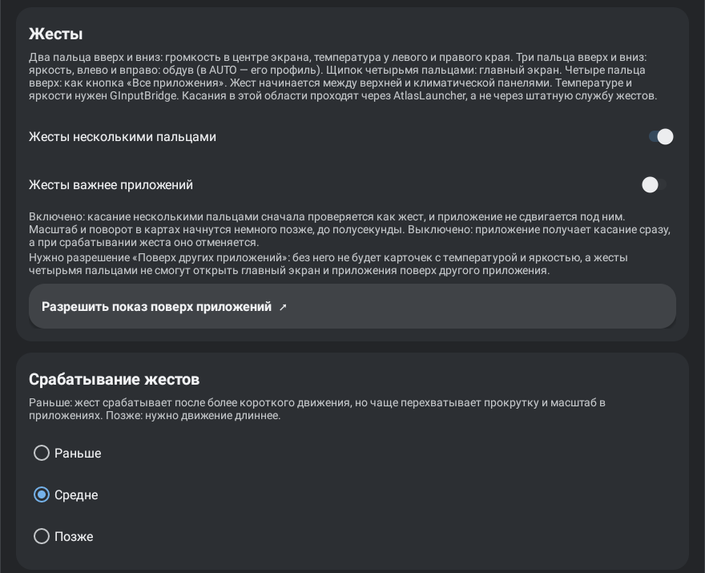

# Жесты несколькими пальцами

AtlasLauncher может распознавать жесты двумя, тремя и четырьмя пальцами в любом приложении, не только на рабочем столе: громкость, температура водителя и пассажира, яркость экрана, обдув, возврат на главный экран и открытие всех приложений. По умолчанию функция выключена.

## Что нужно

- **ГУ OneOS** со службой `EcarxInputDispatcherService`: через неё AtlasLauncher получает касания поверх других приложений. На обычном Android, в том числе на эмуляторе, служба жестов запускается, но касаний не получает.
- **GInputBridge** — для температуры, яркости и обдува. Громкость, «Домой» и «Все приложения» работают без него.
- **Разрешение «Поверх других приложений»** — для карточек с температурой, яркостью и обдувом, а также для жестов четырьмя пальцами поверх другого приложения.

Включение: долгое нажатие на свободное место рабочего стола → `⚙` → карточка «Жесты» → «Жесты несколькими пальцами». Пока жесты включены, в шторке висит уведомление «Жесты включены»: служба работает в отдельном процессе и не зависит от рабочего стола.

## Где работают жесты

Жест должен начаться между верхней строкой состояния и климатической панелью. Начатое в этих полосах касание остаётся у SystemUI. Внутри области все касания сначала проходят через AtlasLauncher, а не через штатную службу жестов OneOS.

Для двух пальцев экран делится на три полосы: левая четверть — температура водителя, середина — громкость, правая четверть — температура пассажира. Оба пальца должны стоять в одной полосе; если они в разных, это не жест. Жесты тремя и четырьмя пальцами работают по всей ширине.

## Жесты

| Пальцы | Движение | Где | Действие | Один шаг |
|---|---|---|---|---|
| 2 | вверх / вниз | середина | громкость музыки | 60 px — одно деление, не больше трёх за раз |
| 2 | вверх / вниз | левая четверть | температура водителя | 60 px — 0,5 °C, от 16 до 28 °C |
| 2 | вверх / вниз | правая четверть | температура пассажира | 60 px — 0,5 °C, от 16 до 28 °C |
| 3 | вверх / вниз | везде | яркость экрана | 70 px — одно деление |
| 3 | вправо / влево | везде | обдув: скорость 1–9, в режиме AUTO — профиль | 80 px — одна ступень |
| 4 и больше | щипок (пальцы сводятся) | везде | главный экран | один раз за касание |
| 4 и больше | вверх | везде | как кнопка «Все приложения» в доке | один раз за касание |

Пока пальцы двигаются, значение меняется шаг за шагом; первый шаг требует чуть большего хода, чем следующие (см. [«Срабатывание жестов»](#срабатывание-жестов)). Громкость показывает штатный индикатор OneOS, остальные значения — карточка AtlasLauncher.

## Карточки

Карточка появляется при каждом шаге и исчезает через полторы секунды. Температура показывается у своего края, яркость и обдув — посередине. На пределе диапазона карточка тоже появляется, чтобы было видно, почему значение не меняется.

| Водитель | Пассажир | Яркость |
|---|---|---|
|  |  |  |

| Обдув | Обдув в режиме AUTO |
|---|---|
|  |  |

В климатическом режиме AUTO автомобиль не принимает ручную скорость вентилятора, поэтому жест переключает профиль авто-обдува: Тихо, Мягко, Комфорт, Сильно, Макс — так же, как AtlasClimateWidget.

## Как отличается жест от обычного касания

- **Все пальцы движутся в одну сторону и сохраняют расстояние между собой.** Масштаб и поворот двумя пальцами в картах, а также масштаб с одним неподвижным пальцем остаются приложению.
- **Ось выбирается первым шагом.** Если три пальца начали менять яркость, движение вбок уже не меняет обдув, и наоборот. Движение в основном поперёк оси жестом не считается.
- **Сначала пальцы должны опуститься.** Пальцы касаются экрана не одновременно, поэтому жест двумя или тремя пальцами ждёт 200 мс после изменения числа пальцев. Движение за это время не теряется, а учитывается после паузы. Четырём пальцам пауза не нужна: их не с чем спутать.
- **Одно касание — один жест, по наибольшему числу пальцев.** Если третий палец опустился, касание уже не станет жестом двумя пальцами. После сработавшего жеста оставшиеся пальцы ничего не делают, пока все не будут подняты. Пятый палец не сбрасывает уже начатый щипок или свайп четырьмя пальцами.

## Настройки

### Жесты важнее приложений

- **Выключено** (по умолчанию). Приложение получает касание сразу. Когда жест делает первый шаг, приложению приходит отмена касания, и до отпускания пальцев оно касаний больше не получает. Карта может немного сдвинуться до срабатывания.
- **Включено.** Касание несколькими пальцами сначала проверяется как жест, и приложение под ним не двигается. Если касание жестом не оказалось, приложение получает его с задержкой — не больше полусекунды. Из-за этого масштаб и поворот в картах начинаются чуть позже.

### Срабатывание жестов

Сколько нужно сдвинуть пальцы, прежде чем жест сработает в первый раз. Следующие шаги и пауза на опускание пальцев от этой настройки не зависят.

| | Раньше | Средне (по умолчанию) | Позже |
|---|---|---|---|
| Первый шаг двумя и тремя пальцами | 1 шаг: 60 / 70 / 80 px | 1,25 шага: 75 / 88 / 100 px | 1,5 шага: 90 / 105 / 120 px |
| Щипок четырьмя пальцами | сблизить на 20 % | на 25 % | на 40 % |
| Четыре пальца вверх | 120 px | 150 px | 180 px |

В столбце первого шага указаны громкость и температура / яркость / обдув. «Раньше» удобнее, но чаще перехватывает прокрутку и масштаб в приложениях, особенно когда «Жесты важнее приложений» выключено. «Позже» близко к порогам прежних тестовых сборок.

## Ограничения

- Расстояния заданы в физических пикселях экрана ГУ 1440×1920. На экране другого размера служба не включается.
- Распознавание проверено JVM-тестами и на эмуляторе с подставленными касаниями. На ГУ последние изменения порогов и настройка «Срабатывание жестов» ещё не проверены.
- Свайп от края экрана OneOS превращает в «Назад»; жесты, начатые у самого края, на ГУ не проверялись.
- Без GInputBridge жесты температуры, яркости и обдува ничего не делают; без разрешения «Поверх других приложений» не показываются карточки, а жесты четырьмя пальцами не открывают главный экран и приложения поверх другого приложения.
