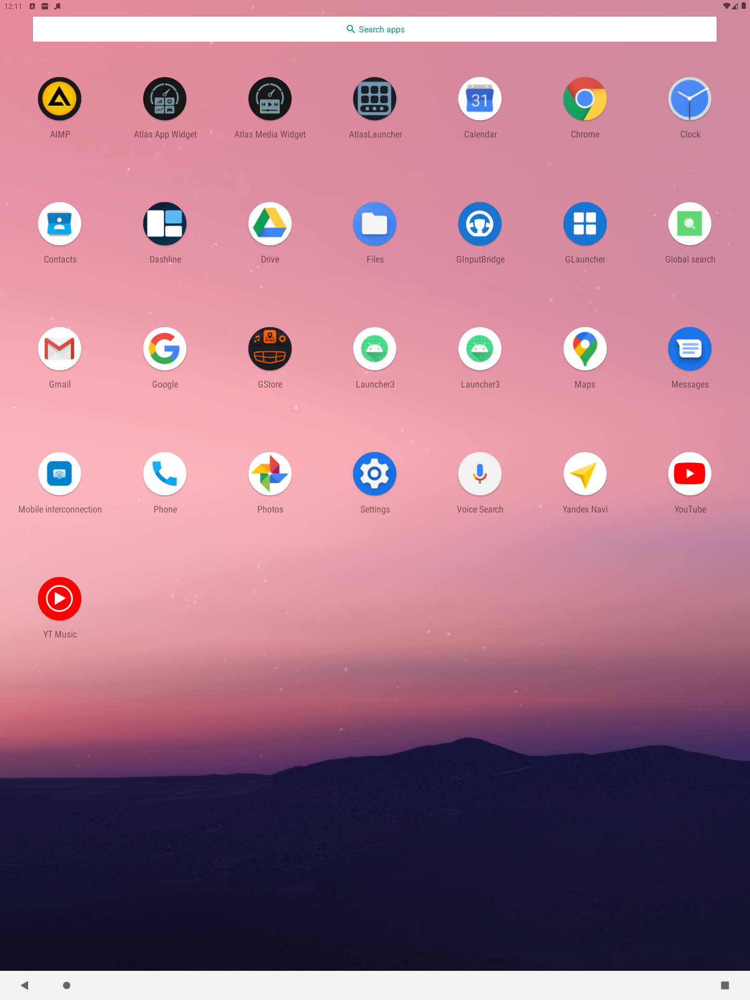

# Иконка и release-подпись

Дата: 2026-09-27. Версия: 0.4.0 (4), ветка main.

## Изменения

- Исходный знак перерисован в Android VectorDrawable: шесть ячеек, док с тремя точками, ровная заливка без растровой текстуры.
- Адаптивные обычная/круглая иконки и monochrome для API 33+; фон и знак разделены, как в AtlasMediaWidget.
- Имена APK и суффикс версии по ветке, подключение локального secure.signing.gradle по схеме AtlasMediaWidget. SDK, AGP и Gradle не обновлялись.
- Локальная подпись использует существующий ключ AtlasMediaWidget; секреты игнорируются Git.

## Проверки сборки

- `:app:assembleDebug`: успешно.
- `:app:assembleRelease`: блокируется существующей ошибкой Lint `ExpiredTargetSdkVersion` (targetSdk 30).
- `:app:assembleRelease -x :app:lintVitalRelease`: успешно, подписанный `0.4.0[4]AtlasLauncher-release.apk`.
- `:app:lintDebug`: 1 ошибка (ExpiredTargetSdkVersion), 14 предупреждений; ошибка не подавлялась в конфигурации.
- `:app:testDebugUnitTest`: NO-SOURCE, JVM-тестов нет.
- `apksigner verify --print-certs`: подпись release APK валидна, SHA-256 сертификата совпадает с локальным release APK AtlasMediaWidget: `eaf9f1b2dc55db196b41c2c947964d6809a6c954d8aa7b45ad6d72133af0217e`.
- `git diff --check`: успешно.

## Эмулятор

Устройство: emulator-5554, sdk_gphone_arm64, Android 11 / API 30.

1. Обновлён debug APK через `adb install -r`, без удаления данных.
2. Открыт каталог штатного `com.android.launcher3/.Launcher`, без смены HOME.
3. Проверена иконка рядом с AtlasMediaWidget: шесть ячеек и три точки видны, круглая маска знак не обрезает.
4. Нажатие AtlasLauncher в каталоге запускает приложение.
5. После force-stop Activity снова успешно запускается, процесс работает; crash buffer пуст.

## Ограничения

- Release APK не устанавливался поверх debug: у них разные ключи. Проверена подпись готового release APK.
- Монохромный вариант API 33+ включён в ресурсы, но на Android 11 визуально не проверяется.
- ГУ OneOS не подключено; OEM UI не проверялся.
- Сборки сделаны из текущей рабочей копии, включая ранее существовавшие незакоммиченные изменения HomeActivity. Эти изменения не входят в коммит иконки/сборки.

## Уточнение цветов, 2026-09-27

Цвет знака исправлен на `#7893A0` — точное значение непрозрачных пикселей foreground PNG AtlasMediaWidget. Фон исправлен на `#171717` из его `icon_background`. Геометрия не менялась.

Debug и release 0.4.0 (4) пересобраны успешно (`:app:assembleDebug :app:assembleRelease -x :app:lintVitalRelease`). Release-подпись проверена apksigner, сертификат прежний. Debug установлен обновлением на emulator-5554 (Android 11); цвета проверены рядом с AtlasMediaWidget в каталоге Launcher3. `git diff --check` пройден.

