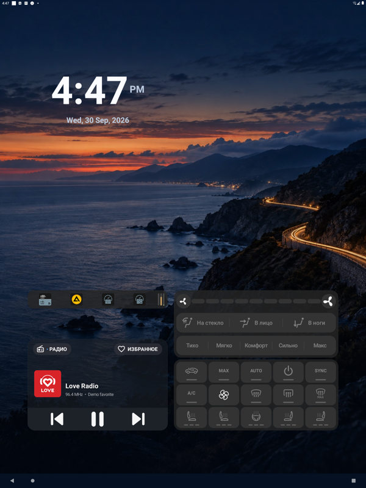

# Виджеты высотой в один ряд

## Проблема

Ни один AppWidget нельзя было сделать высотой в 1 ряд сетки: Atlas App Widget (`minResizeHeight=72dp`), Yandex TrafficWidget*x1 (40dp), AIMP (40dp) получали минимум 2 ряда. В 1 ряд помещались только встроенные часы и док.

## Причина

Минимальная высота считалась как `Math.max(96, minResizeHeight) + padding.y`. 96dp — это уже целая ячейка, поэтому при любом ненулевом padding выходило больше ячейки, а округление вверх давало 2 ряда. Кроме того, при каждом показе высота сохранённого виджета доводилась до `96 + padding.y`. Ограничение было с первого коммита без объяснения; «не меньше одной ячейки» и так обеспечивает `WidgetGrid.span() ≥ 1`.

Padding на эмуляторе (sw1440dp, ресурсы `sw720dp` в `framework-res.apk`): `default_app_widget_padding` 12/4/12/20dp, то есть по высоте 24dp. На API 30 от targetSdk провайдера зависит только порог `>= 14`. У ГУ по `qa/head-unit-state` тоже sw1440dp.

## Изменение

`max(96)` убран из расчёта высоты в пикере, при добавлении, при восстановлении (`minRows`) и при ресайзе; доводка до `96 + padding.y` удалена. Часы, док и fixed-layout OEM-виджеты не затронуты.

## Проверка

- Эмулятор `emulator-5554` (API 30, 1440×1920, density 160), debug `0.5.0[15]`, 2026-09-30.
- Сохранённые размещения после установки не изменились.
- Atlas App Widget уменьшен жестом с 2 рядов до 1 (`height: 96`), размер сохранился после force-stop и перезапуска. Содержимое помещается в 72dp.
- Пикер: Yandex Navi 2×1/3×1/4×1, AIMP 3×1, Chrome/YouTube Music 3×1, Google 4×1/5×1, Drive 4×1; Atlas App Widget остаётся 3×2 при добавлении (`minHeight=90dp`).

## Ограничения

На ГУ не проверено; если OEM-оверлей меняет `default_app_widget_padding_*`, минимумы будут другими. Добавление новых Yandex/AIMP в 1 ряд проверено только по подписи в пикере.
