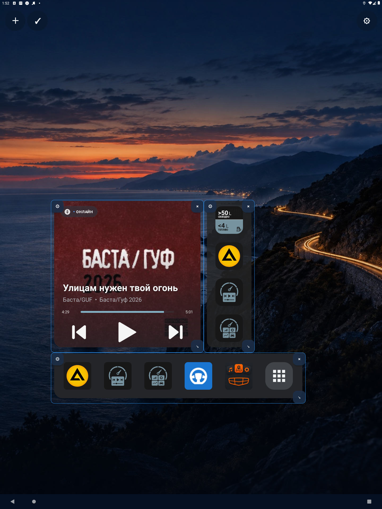
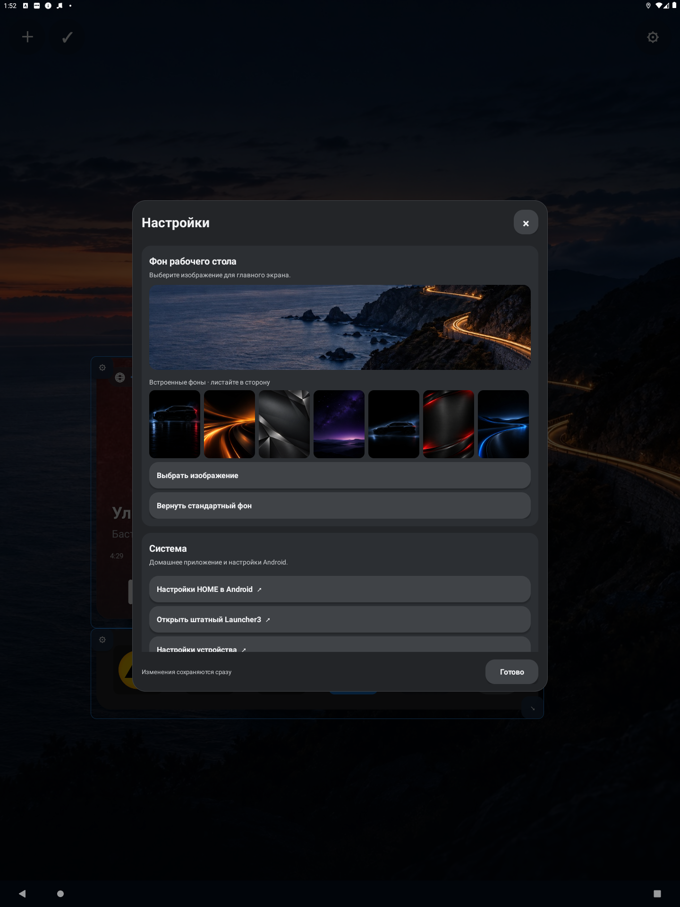

# Шестерёнка настроек только в режиме редактирования

- Устройство: эмулятор `emulator-5554`, Android 11 (API 30), 1440×1920.
- APK: `0.5.0[15]AtlasLauncher-debug.apk`.

## Шаги и результат

1. `am force-stop`, запуск `HomeActivity`: в UI-дампе нет «Настройки и возврат к штатному HOME», «Добавить виджет», «Завершить редактирование».
2. Долгое нажатие на свободное место: появились `＋`, `✓` слева и `⚙` справа.
3. Нажатие `⚙`: открылось окно настроек с карточками «Фон рабочего стола» и «Система»; карточки «Рабочий стол» больше нет.
4. «Назад» закрыл окно, режим редактирования и шестерёнка остались.
5. Короткое нажатие на свободное место: режим завершён, шестерёнка скрыта.

## Ограничения

На ГУ не проверено. Путь к «Настройки HOME в Android» и «Открыть штатный Launcher3» теперь требует долгого нажатия на рабочий стол, виджет или док.
