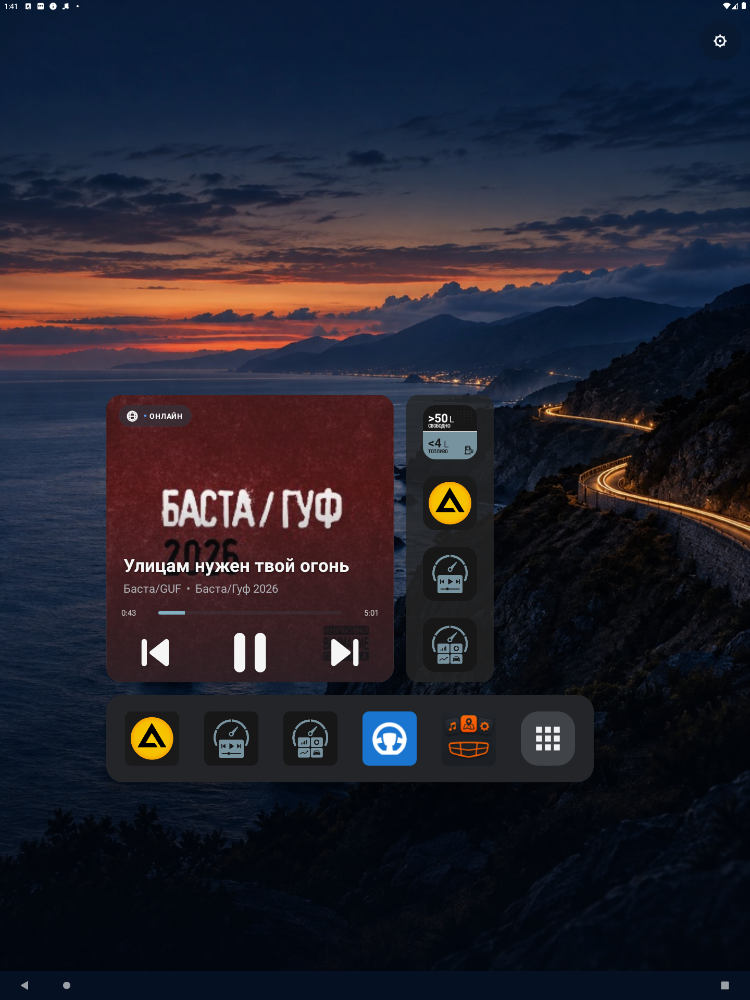
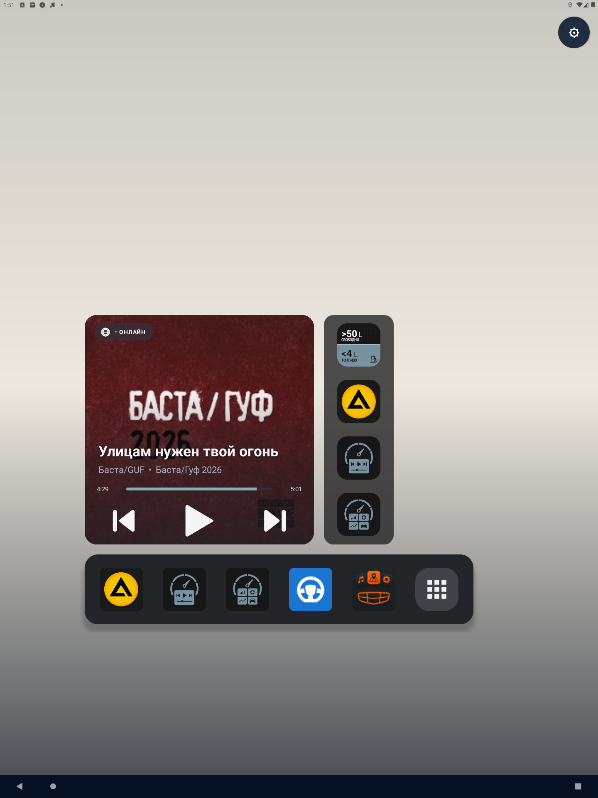

# Прозрачная строка состояния

- Устройство: эмулятор `emulator-5554`, Android 11 (API 30), 1440×1920.
- APK: `0.5.0[15]AtlasLauncher-debug.apk`.

## Шаги

1. Установить APK, `am force-stop`, запустить `HomeActivity`.
2. Сравнить верх экрана: раньше строка состояния была залита `rgb(8, 24, 45)`.

## Результат

Строка состояния прозрачная, обои видны под ней, как у Launcher3. Кнопка настроек и сетка виджетов остаются ниже строки состояния (отступ по `WindowInsets`); положение виджетов не изменилось.

## Цвет значков

Как Launcher3, значки становятся тёмными (`SYSTEM_UI_FLAG_LIGHT_STATUS_BAR`) по правилу `WallpaperColors.HINT_SUPPORTS_DARK_TEXT` из Android 11: средняя HSL-яркость > 0.75 и меньше 2.5% пикселей с контрастом к чёрному ≤ 6. В отличие от Launcher3, оценивается не весь фон, а полоса под строкой состояния с учётом затемнения.

- Встроенный фон `coastal_twilight`: `vsysui=LAYOUT_STABLE LAYOUT_FULLSCREEN`, значки светлые (снимок выше).
- Светлый фон (однотонный `#F5F0E6`, подложен через `run-as` в `files/` и `wallpaper` в `home.xml`): `vsysui=... LIGHT_STATUS_BAR`, значки тёмные. После проверки `home.xml` восстановлен, файл удалён.

## Ограничения

На ГУ не проверено: OEM-плагин SystemUI может рисовать собственный фон строки состояния и может не учитывать `LIGHT_STATUS_BAR`. Смена фона из окна настроек во время работы отдельно не проверялась; она идёт через тот же `showWallpaper()`.
