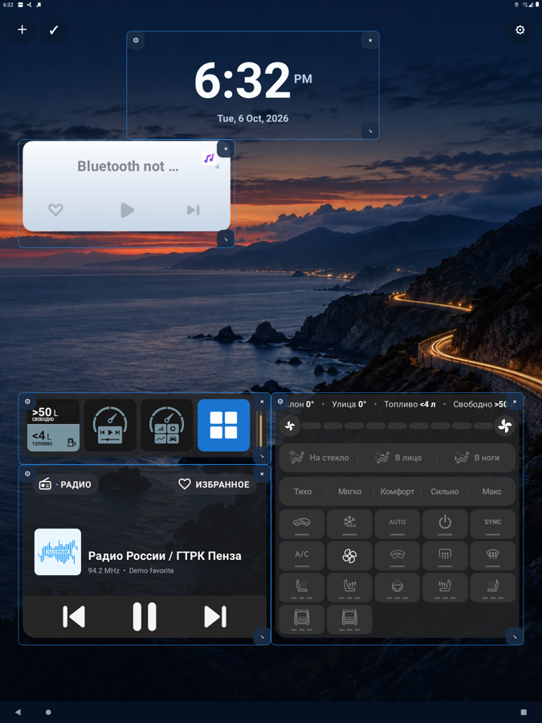
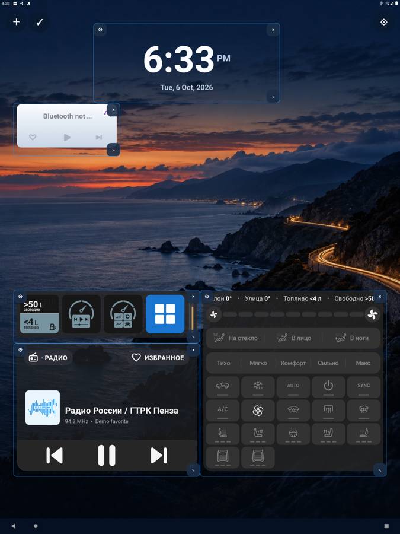
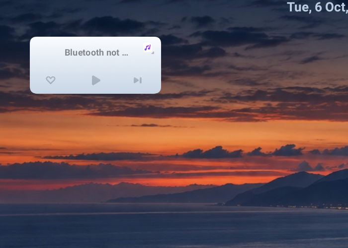

# Изменение размера нерастягиваемых виджетов

- Устройство: эмулятор Android 11, 1440×1920, density 160 (как ГУ G636).
- APK: `1.1.1-force-widget-resize[18]AtlasLauncher-debug.apk` из ветки `force-widget-resize` (c41ea54).

## Что изменилось

- Кнопка `↘` есть у всех виджетов, размер меняется по обеим осям.
- Виджет с фиксированной разметкой (корень и размеры заданы числом, их распознаёт `fixedLayoutPx`) масштабируется `FittedWidgetView` и уменьшается до одной ячейки.
- Остальные виджеты: по оси, которую провайдер разрешил, минимум прежний (`minResizeWidth/Height`), по запрещённой оси — начальный размер (`minWidth/Height`). Ту же границу использует перестройка сетки.

## Разметка нерастягиваемых виджетов на эмуляторе

| Провайдер | `resizeMode` | Разметка | Попадает под уменьшение |
|---|---|---|---|
| `com.geely.mediawidget` 6×3 (`source_widget`) | 0 | 516×224 px, все дочерние размеры в px | да |
| `com.geely.mediawidget` 5×5 (`source_big_widget`) | 0 | 480×480 px, все дочерние размеры в px | да |
| `com.geely.mediawidget` 6×4 (`source_list`) | 0 | ширина 480 px, высота `wrap_content`, `ListView` | нет |
| Яндекс «Пробки» (6 провайдеров) | 0 | `match_parent` и вес, карта `centerCrop` | нет |

## Шаги и результат

1. Режим редактирования → `+` → `com.geely.mediawidget · 6×3`: виджет занял 6×3 ячейки, `↘` доступна.
2. Уменьшение до 4×2: карточка пропорционально уменьшилась (масштаб ≈ 0,74), ничего не обрезано.
3. Уменьшение до 3×2: масштаб ≈ 0,56, все элементы на месте, текст и кнопки мелкие, под карточкой свободное место.
4. `am force-stop` и повторный запуск: размещение `x:0, y:288, width:288, height:192` сохранилось.

## Ограничения

- На ГУ не проверено; читаемость уменьшенной карточки на экране ГУ не оценена.
- Нажатия на уменьшенной карточке не проверены: на эмуляторе нет Bluetooth и активного источника.
- Увеличение виджетов с гибкой разметкой (Яндекс) на эмуляторе не проверялось; по разметке ожидается свободное место вокруг содержимого.
- Если увеличенный нерастягиваемый виджет перестаёт помещаться при перестройке сетки, он сжимается не ниже начального размера; если не помещается и так, остаётся на прежнем месте, как раньше.
- `lintDebug`: только ожидаемая `ExpiredTargetSdkVersion`, новых предупреждений нет.
