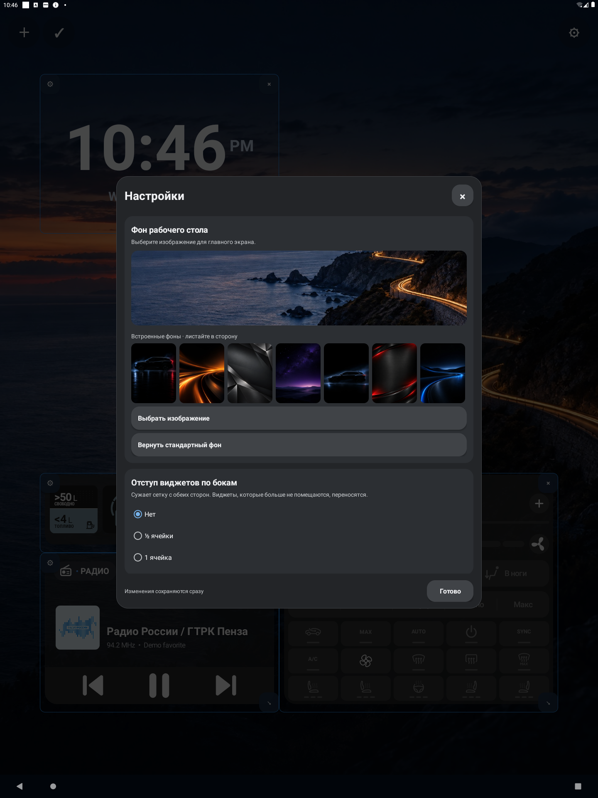
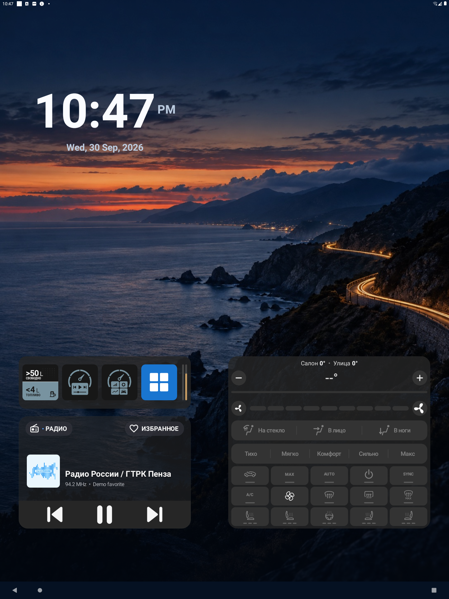

# Отступ виджетов по бокам

- Устройство: эмулятор Android 11, 1440×1920, density 160 (как ГУ G636).
- APK: `0.5.0[15]AtlasLauncher-debug.apk` из рабочей копии.

## Шаги и результат

1. Раскладка до изменения: 15 столбцов, левый столбец пустой, виджеты с x = 96 dp.
2. Режим редактирования → `⚙` → «Отступ виджетов по бокам» → «½ ячейки»: сетка сужается до 14 столбцов, правый виджет заканчивается в 48 dp от края (1392 dp). Левые виджеты сдвигаются вместе с сеткой на 144 dp, так как их столбец сохраняется.
3. Перетаскивание левых виджетов в первый столбец: x = 48 dp.
4. `am force-stop` и повторный запуск: отступ и положения сохранились (48…624 и 720…1392 dp).

## Ограничения

- На ГУ не проверено.
- При смене отступа виджеты не остаются на прежнем месте экрана: они сдвигаются вместе с сеткой, а не помещающиеся переносятся. Обратная смена отступа прежнюю раскладку не восстанавливает.
- На экране, ширина которого не кратна 96 dp, остаток ширины остаётся справа, как и без отступа.
